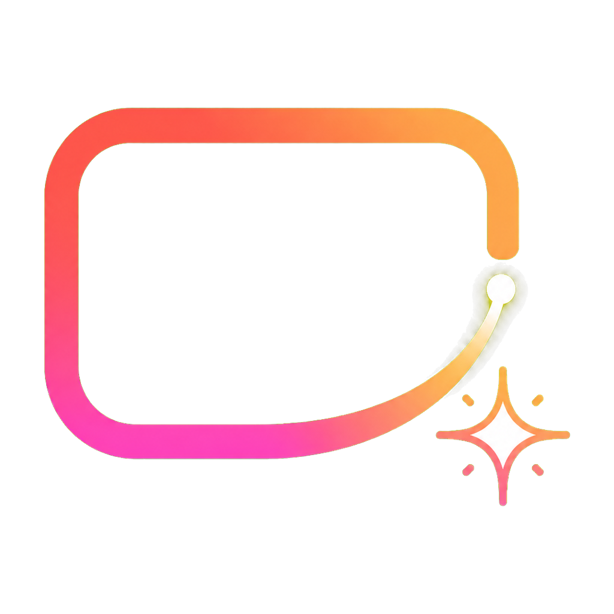
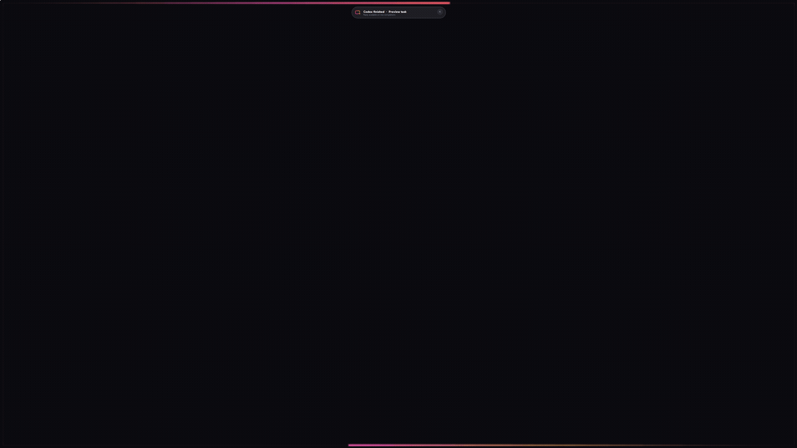
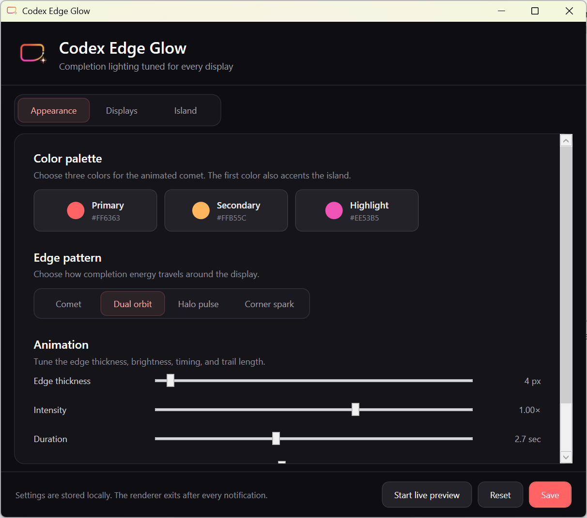

<p align="center">
  
</p>

<h1 align="center">Codex Edge Glow</h1>

<p align="center"><strong>Know when your agent is done.</strong></p>

<p align="center">
  Customizable Windows edge lighting and a floating task-completion island for Codex agents.
</p>

<p align="center">
  <a href="https://github.com/ajhcs/codex-edge-glow/releases/latest"><strong>Download the latest release</strong></a>
  · <a href="docs/installation.md">Installation</a>
  · <a href="docs/configuration.md">Configuration</a>
  · <a href="CONTRIBUTING.md">Contributing</a>
</p>

<p align="center">
  
  
  <a href="LICENSE"></a>
  <a href="https://github.com/ajhcs/codex-edge-glow/actions/workflows/ci.yml"></a>
</p>



Codex Edge Glow turns the end of a background task into something you cannot miss: a smooth, color-controlled animation around the physical edges of your monitor, plus an optional top-center island with the result and a quick-reply field.

It is a small native Windows utility—not a browser extension, Electron shell, or cloud service.

> [!IMPORTANT]
> Codex Edge Glow is an independent community project. It is not affiliated with or endorsed by OpenAI, Microsoft, Samsung, Apple, or Xiaomi. Product names are used only to describe compatibility or visual inspiration.

## Why it exists

Agent work often finishes while you are reading, coding, or working on another display. Ordinary toasts are easy to miss and usually do not carry enough context. Codex Edge Glow gives completion a calm but unmistakable visual language without stealing focus.

Two separate surfaces work together:

- **Edge lighting** provides ambient awareness across one or more monitors.
- **Completion island** provides the task name, a result excerpt, dismissal, and optional reply.

Either surface can be disabled independently.

## What you can customize

- Four animation patterns: **Comet**, **Dual orbit**, **Halo pulse**, and **Corner spark**
- Three-color palettes, intensity, thickness, duration, trail length, and faint frame
- Per-display enablement, insets, and independently calibrated corner radius
- Compact, detailed, or disabled completion island
- Island width, top offset, duration, message length, and multi-display behavior
- Live preview that updates while you drag sliders or switch patterns
- Full-screen calibration overlay with single-pixel controls
- Notification-area icon with **Open settings**, **Toggle live preview**, and **Exit**
- Optional quick reply routed back through the local Codex CLI



## Quick start

### 1. Download

Download the newest version from [GitHub Releases](https://github.com/ajhcs/codex-edge-glow/releases/latest) and place the executable in a stable folder such as:

```text
%LOCALAPPDATA%\CodexEdgeGlow\codex-edge-glow.exe
```

The first public builds are portable and unsigned. Windows SmartScreen may therefore show an unrecognized-app warning. Download only from this repository and compare the SHA-256 hash with the release's `SHA256SUMS.txt`. See [Installation and verification](docs/installation.md).

### 2. Open settings

```powershell
& "$env:LOCALAPPDATA\CodexEdgeGlow\codex-edge-glow.exe" --settings
```

Use **Start live preview** while changing colors, patterns, island size, and timing. The preview stays open and updates without restarting the settings process.

### 3. Connect the Codex notification hook

Add the executable to the top level of `%USERPROFILE%\.codex\config.toml`:

```toml
notify = ["C:\\Users\\YOUR_NAME\\AppData\\Local\\CodexEdgeGlow\\codex-edge-glow.exe"]
```

Restart the Codex CLI after saving the file. If you already use another notification command, read [Codex integration](docs/integrations.md) before replacing it; this app can forward the event to an existing notifier.

> [!NOTE]
> The external `notify` hook is a Codex CLI feature. Support in Codex Desktop and other app-server hosts can vary by release. The manual preview always works, but automatic completion events depend on the Codex surface that launches the app.

## Commands

| Command | Purpose |
| --- | --- |
| `codex-edge-glow.exe --settings` | Open the settings editor and tray resident |
| `codex-edge-glow.exe --preview` | Play one sample completion |
| `codex-edge-glow.exe --preview-hold` | Play an extended sample for testing or capture |
| `codex-edge-glow.exe --calibrate --device "\\.\DISPLAY1"` | Open the full-screen fit guide on one monitor |
| `codex-edge-glow.exe --device "\\.\DISPLAY1" --preview` | Preview only one monitor |

## Privacy and data flow

- No telemetry, advertising SDK, analytics service, updater, or embedded web request is present.
- Settings are stored locally at `%LOCALAPPDATA%\CodexEdgeGlow\settings.xml`.
- The app receives the Codex completion payload as a process argument and renders a shortened local excerpt.
- Quick reply is optional. When used, the app starts the locally installed `codex.exe`, passes the task identifier on the command line, and writes your reply to that process through standard input.
- The renderer exits after a normal notification. The settings process remains running only when its window or tray icon is active.

See [Architecture](docs/architecture.md) for the exact process and rendering boundaries.

## Performance target

The project has a design target of **less than 100 MB working set per process**. On the original Windows 11 development machine with a 3802 × 2138 physical primary display at 150% scaling:

- standalone completion overlay: **51.9 MB peak observed working set**;
- settings plus active live preview: **87.8 MB peak observed working set**.

These are measured observations, not a guarantee for every Windows build, GPU driver, monitor layout, or accessibility configuration. Rendering and lifecycle changes should include a before/after working-set measurement.

## Build from source

Requirements:

- Windows 10 or 11 development environment
- Visual Studio 2022 Build Tools with the .NET Framework 4.8 targeting pack, or the built-in .NET Framework compiler fallback
- PowerShell 5.1 or newer

```powershell
git clone https://github.com/ajhcs/codex-edge-glow.git
cd codex-edge-glow
.\scripts\build.ps1 -Configuration Release
.\scripts\test.ps1
```

The release executable is written to `artifacts\bin\Release\codex-edge-glow.exe`. The complete local suite includes geometry, layered-alpha, live-preview stress, and physical-DPI boundary checks.

## Contributing

Contributions are welcome from Windows users, designers, accessibility testers, documentation writers, and C# developers. You do not need to begin with a major feature: display configurations, reproducible bug reports, screenshots with private data removed, docs improvements, presets, and focused tests are all valuable.

Start with [CONTRIBUTING.md](CONTRIBUTING.md) or browse [`good first issue`](https://github.com/ajhcs/codex-edge-glow/labels/good%20first%20issue) tasks.

## Project status

The project is in an early public-preview stage. The rendering foundation, live settings preview, per-monitor DPI support, calibration flow, tray lifecycle, and quick reply exist today. Packaging, signing, localization, reduced-motion controls, and broader Windows/display validation are active roadmap areas.

See [ROADMAP.md](ROADMAP.md), [CHANGELOG.md](CHANGELOG.md), and [known troubleshooting paths](docs/troubleshooting.md).

## Support and security

- Setup questions and ideas: [GitHub Discussions](https://github.com/ajhcs/codex-edge-glow/discussions)
- Reproducible bugs: [Issue forms](https://github.com/ajhcs/codex-edge-glow/issues/new/choose)
- Security reports: follow [SECURITY.md](SECURITY.md) and do not open a public issue
- Community expectations: [CODE_OF_CONDUCT.md](CODE_OF_CONDUCT.md)

## License

Codex Edge Glow is available under the [MIT License](LICENSE).

## Inspiration

The project is inspired by the ambient edge-lighting and floating-status concepts found across modern phones, including Samsung edge lighting and floating-island interfaces from Apple and Xiaomi. The Windows implementation, custom artwork, interaction model, and source code in this repository are original to this project.
